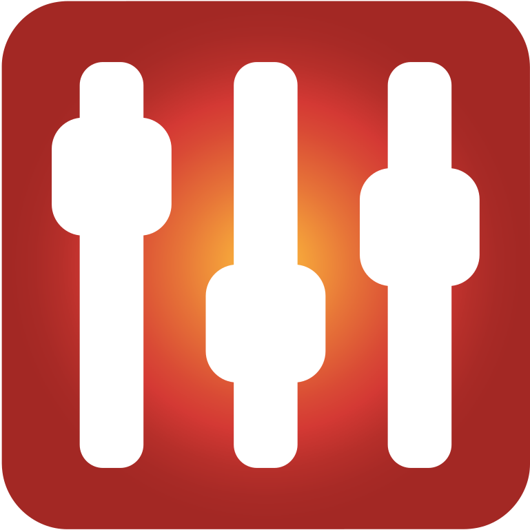
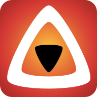
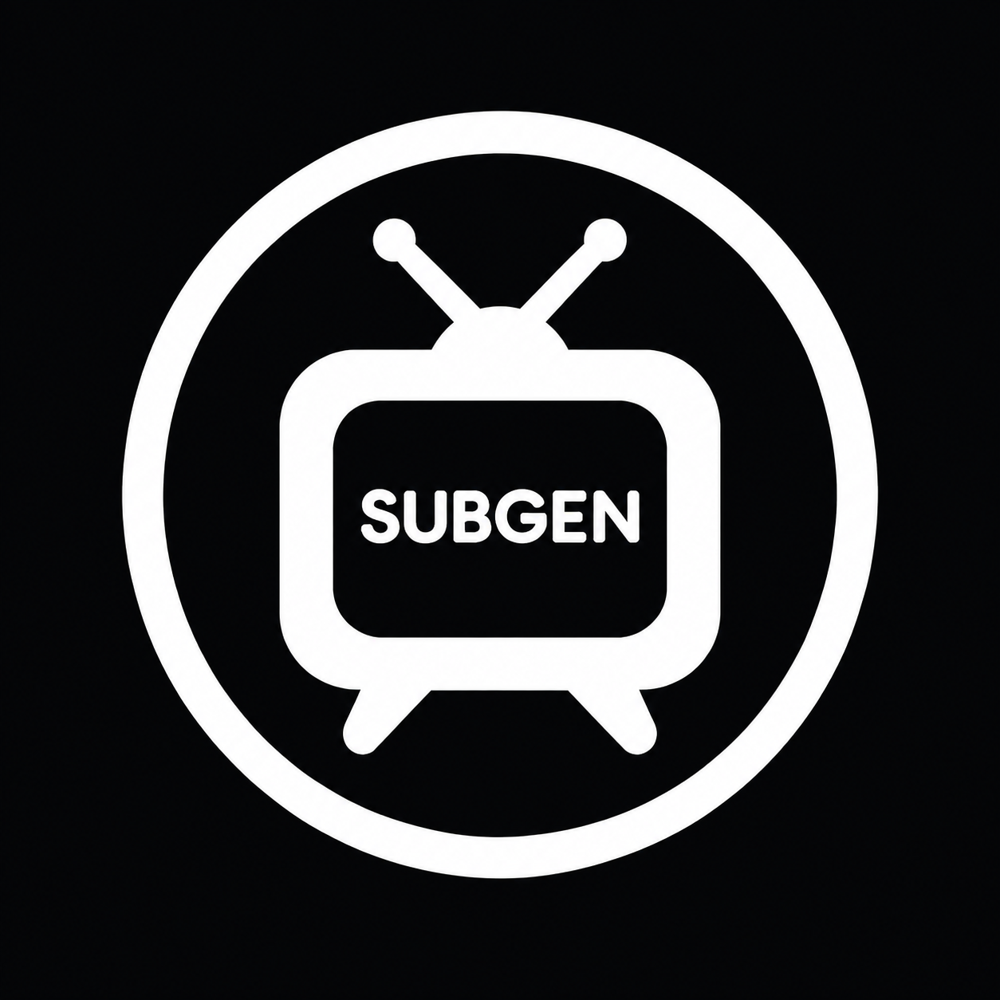

# unraid-icons

Icons for my Unraid server: animated folder icons for the Docker Folder plugin, and
logos for containers that do not ship a usable one.

## Animated Docker folder icons

The orange animated icons are from
[hernandito's unRAID Docker Folder Animated Icons](https://github.com/hernandito/unRAID-Docker-Folder-Animated-Icons---Alternate-Colors)
(the Orange Collection, which upstream has since moved to its `deprecated/` folder in
favour of the newer flat collections). All credit for them goes to hernandito. For the
current sets, use upstream.

                                              

Added here as needed:

-  `orange-3d-printing.svg`, a 3D printing icon in the same style
- PNG copies of a few icons (`ai`, `dash`, `database`, `finances`, `search`, `ship`) for places that do not take SVG

## Container logos

Logos for containers whose templates lack an icon, taken from each project. They belong
to their respective projects. `fundbot` and `helix-viewer` are my own projects.

           

## Using them

Point an icon field at the raw file, for example:

```
https://raw.githubusercontent.com/adman234/unraid-icons/main/orange-downloads.svg
```

`Docker.json` is my Docker Folder plugin export, which references the icons from
`/mnt/user/appdata/icons/`.
